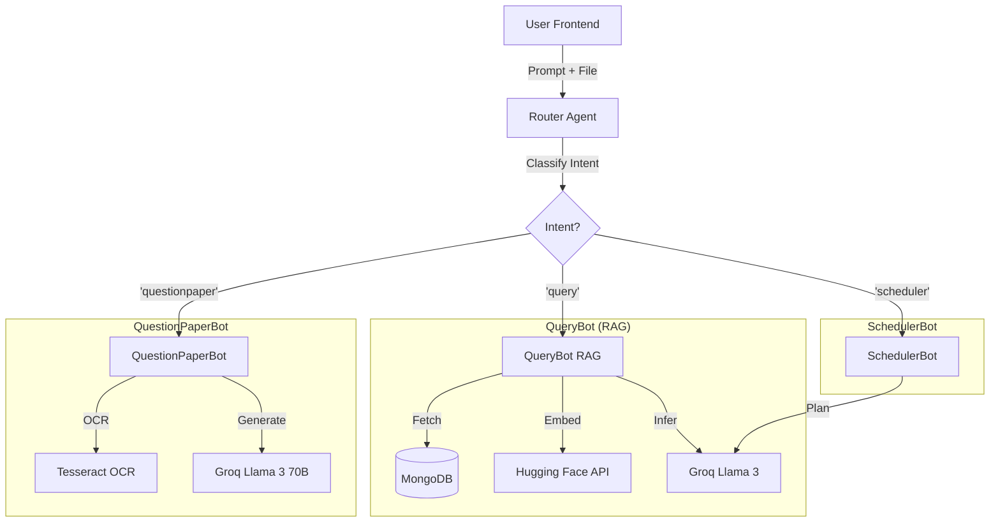

# 🎓 Nexus: AI Tutor & Academic Assistant


**Nexus** is an advanced AI-powered academic assistant designed specifically for the IIT Indore community. It leverages **Retrieval-Augmented Generation (RAG)** to answer curriculum-specific queries, solves uploaded question papers using OCR & LLMs, and generates personalized study schedules.

---

## 🔗 Live Demo

| Service | URL | Status |
| :--- | :--- | :--- |
| **Frontend (App)** | [**Visit Nexus AI**](https://iiti-tutor.vercel.app/) | 🟢 Live |
| **Backend (API)** | [**API Docs**](https://iiti-tutor.onrender.com/docs) | 🟢 Live |

---

## Key Features

### 1. Context-Aware AI Tutor (RAG)

* Answers queries based on the **official First Year Curriculum** stored in MongoDB.
* Uses **Hugging Face Embeddings** and **FAISS vector search** to retrieve relevant course chunks.
* Maintains **conversation history** for context-aware follow-up questions (e.g., asking for *reference books* after discussing a subject).

### 2. Intelligent Question Paper Bot

* **Paper Solver**: Upload a PDF question paper; the bot uses **OCR (Tesseract)** to extract text and **Llama 3 (via Groq)** to generate detailed, step-by-step solutions.
* **Mock Paper Generator**: Generates new, similar question papers based on the structure and difficulty of an uploaded file or specific topics.
* **Smart Routing**: Automatically detects whether a file is present or if the user wants to generate a paper from scratch using RAG.

### 3. AI Study Scheduler

* Creates structured, realistic **daily or weekly study schedules**.
* Parses natural language requests (e.g., *"Plan a schedule for my Quantum Physics exam on Monday"*).

### 4. High-Performance Architecture

* **Backend**: Asynchronous **FastAPI** server optimized for concurrent requests.
* **Memory Efficient**: Uses **Lazy Loading** and API-based embeddings to run on lightweight cloud instances (Render Free Tier).
* **Global Access**: Dockerized container with system-level dependencies (Poppler, Tesseract).

---

##  Tech Stack

### Frontend

* **Framework**: React / Next.js (Vite)
* **Styling**: Tailwind CSS
* **Deployment**: Vercel

### Backend

* **Framework**: FastAPI (Python)
* **Database**: MongoDB Atlas (Async Motor Driver)
* **AI Models**:

  * **LLM**: Llama 3.1-8b-Instant & Llama 3.3-70b-Versatile (via Groq)
  * **Embeddings**: `sentence-transformers/all-MiniLM-L6-v2` (via Hugging Face Inference API)
* **OCR & Processing**: pytesseract, pdf2image, poppler-utils
* **Deployment**: Docker on Render

---

##  Architecture

The system follows a **Microservices-lite** pattern managed by a central **RouterAgent**:



---

## Local Installation

### Prerequisites

* Python 3.10+
* Node.js & npm
* MongoDB Atlas connection string
* API Keys: **Groq Cloud**, **Hugging Face**
* System Tools: `poppler-utils` and `tesseract-ocr` (if running locally without Docker)

---

### 1️⃣ Backend Setup

```bash
# Clone the repository
git clone https://github.com/your-username/nexus-ai-tutor.git
cd nexus-ai-tutor/backend

# Create virtual environment
python -m venv venv
source venv/bin/activate  # On Windows: venv\Scripts\activate

# Install dependencies
pip install -r requirements.txt

# Run server
uvicorn main:app --reload
```

---

### 2️⃣ Frontend Setup

```bash
cd ../frontend

# Install dependencies
npm install

# Run development server
npm run dev
```

---

## 🔐 Environment Variables

### Backend (`.env`)

```env
MONGO_URI=mongodb+srv://<username>:<password>@cluster.mongodb.net/?retryWrites=true&w=majority
GROQ_API_KEY=gsk_...
HF_TOKEN=hf_...
```

### Frontend (`.env.local`)

```env
VITE_BACKEND_URL=http://localhost:8000
```

---

## 🐳 Docker Deployment (Production)

The backend is fully containerized to handle system dependencies like OCR tools.

```dockerfile
FROM python:3.10-slim

WORKDIR /app

# Install system dependencies for PDF/OCR
RUN apt-get update && apt-get install -y \
    poppler-utils \
    tesseract-ocr \
    libgl1 \
    && rm -rf /var/lib/apt/lists/*

COPY requirements.txt .
RUN pip install --no-cache-dir -r requirements.txt

COPY . .

EXPOSE 8000
CMD ["uvicorn", "main:app", "--host", "0.0.0.0", "--port", "8000"]
```

---

## Contributing

Contributions are welcome! Please follow these steps:

1. Fork the repository
2. Create a new branch (`git checkout -b feature/AmazingFeature`)
3. Commit your changes (`git commit -m 'Add some AmazingFeature'`)
4. Push to the branch (`git push origin feature/AmazingFeature`)
5. Open a Pull Request

---

## License

Distributed under the **MIT License**. See `LICENSE` for more information.

---

<p align="center">Made with ❤️ for the IITI Community</p>
